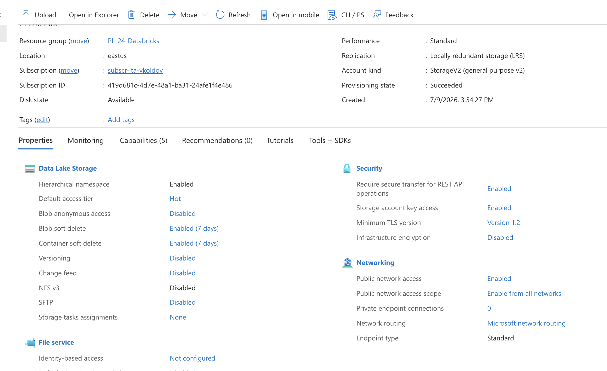
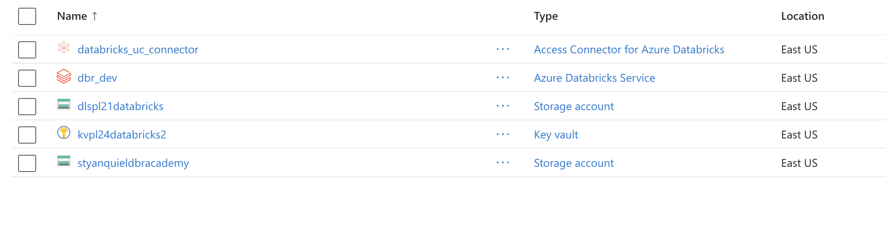
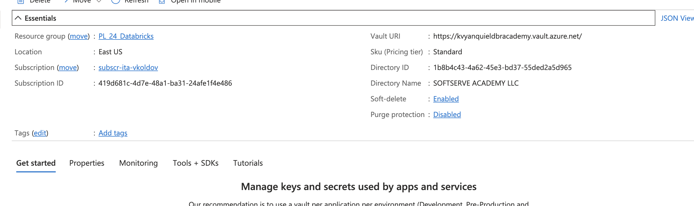
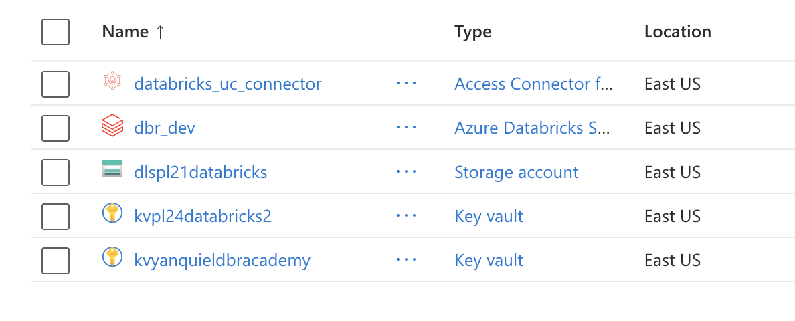
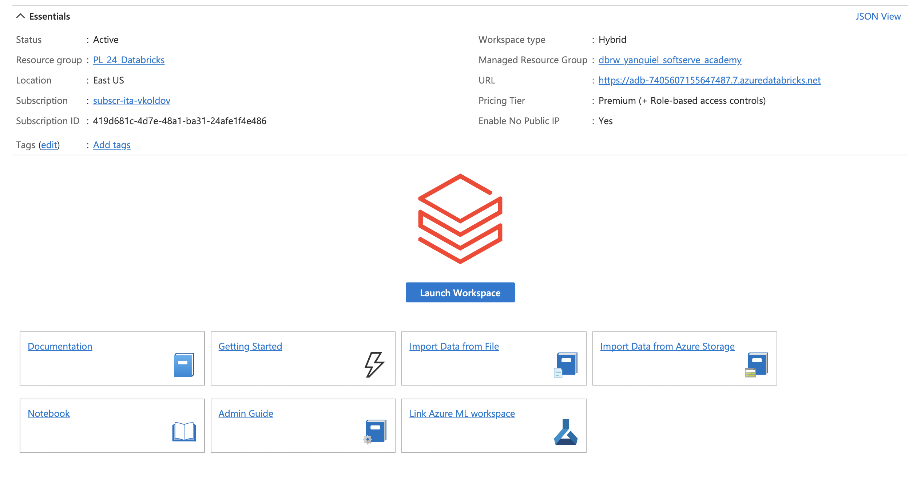
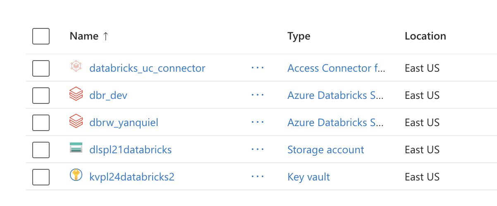

# Stage 1 — Individual Resource Creation

## Storage Account (ADLS Gen2)

Storage account `styanquieldbracademy` with **Hierarchical Namespace enabled** (required for ADLS Gen2), **LRS** redundancy, **Hot** access tier, and public network access enabled.

Resource group view right after  Storage Account creation — `styanquieldbracademy` now appears alongside the pre-existing shared resources.

## Key Vault

Key Vault `kvyanquieldbracademy` on the **Standard** tier, with **soft-delete enabled** and **purge protection disabled**.

Resource group view after Key Vault creation — `kvyanquieldbracademy` is now listed together with the Storage Account.

## Databricks Workspace

Databricks workspace `dbrw_yanquiel` on the **Premium** tier, with **No Public IP enabled** and an auto-generated **managed resource group** (`dbrw_yanquiel_softserve_academy`) for its internal resources.

Resource group view after Databricks Workspace creation — `dbrw_yanquiel` completes the set of three resources created for this exercise.
